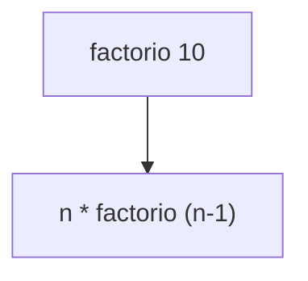

# Assinaturas das funções

O haskell é fortemente tipado o que significa que uma vez que o argumento da função é definido esse tipo importa. Por exemplo, se você define que o argumento "X" é do tipo inteiro você não consegue mesclar ele com um atributo "Y" do tipo caracter. A nãos ser que voce mapeie, construa uma função que converte o valor inteiro em um caracter.


Para indicar o tipo que o argumente deve ser use as assinaturas de funções. As assinaturas indicam para o compilador que tipo ele deve esperar. Por exemplo a função soma deve receber parametros de variaveis inteiras (e.g. o numero 1, 2,3). 


<!-- O preludio é o tempo que o haskell constroi e compoem as regras do seu programa. -->

Tempo de compilação (do ingles compile time), é o tempo que o haskell constroi as regras do seu programa e gera um executavel.
<!-- statements vs expressions -->

## Construindo a sua primeira regra de mapeamento.

Crie um documento chamado "Main.hs" e escreva dentro dele sua primeira regra. Essa regra sera usada para somar dois valores do tipo inteiro.

```haskell
-- Main.hs primeira função
soma_dois_inteiros :: Int -> Int => Int
soma_dois_inteiros x y = x + y
```
## Usando sua primeira regra.
Execute o ghci dentro da pasta que contem o arquivo e digite o comando a seguir para carregar o modulo, as regras :
```haskell
:l Main -- para carregar o modulo
```

Em seguida execute a regra para somar dois inteiro com os valores 10 e 10.

```haskell
soma_dois_inteiros 10 10
-- deve retorar 20

Quando você tenta executar essa regra usando um elemento de tipo incompativel, de um tipo diferente da assinatura da função, o compilador irá le informar um erro.

```haskell
soma_dois_inteiros 10 10.1
-- deve levantar um erro dissendo que "No instance for (Fractional Int) arising from the literal `10.2'"
```

O erro acontece quando se digita 'soma_dois_inteiros 10 10.1" porque o valor '10.1' ele não é do tipo inteiro. E o tipo do argumento uma vez definido IMPORTA!


## Recursividade
Recurisvidade vai ter o caso BASE e encontrar o caso recursivo. 

```haskell
factorial :: (Integral a) => a -> a  
factorial 0 = 1  
factorial n = n * factorial (n - 1)  
```

## Desafio construa o quick sort.




# Outras considerações


Correspondência de padrões Pattern matching consists of specifying patterns to which some data should conform and then checking to see if it does and deconstructing the data according to those patterns.

When defining functions, you can define separate function bodies for different patterns. This leads to really neat code that's simple and readable.

As assinaturas ajudam o compilador a levantar erros caso venha um tipo errado.


## Um exemplo de linguagem fracamanete tipada

Caso você queria ver o que uma linguagem fracamente tipada pode fazer de uma olhada no (vídeo sobre o js)[https://www.destroyallsoftware.com/talks/wat]


# Referencia

- http://learnyouahaskell.com/syntax-in-functions